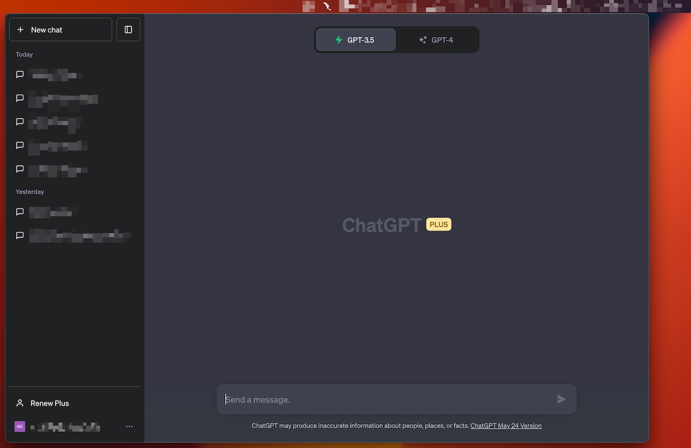

# Machate

Machate is a desktop application that provides a quick and convenient way to access ChatGPT on macOS. 



This app takes inspiration from [chatgpt-mac](https://github.com/vincelwt/chatgpt-mac), but written from scratch with some much-needed improvements.

It might also work on Windows and Linux but hasn't been tested yet.

## Features

* Native macOS integration with a menubar icon for quick access
* You don't need any OpenAI API key to use it, just an OpenAI account.
* Configurable hotkey to show/hide the chat window (default is CMD+Shift+g).
* The window stays on top until you press your hotkey again, copy-pasting parts of the conversation is easier than ever.
* You can press CMD+1, CMD+2... to access your first history items.
* No analytics, so you can use this on your day job (as long as they allow using ChatGPT).

## Usage

Download and install the latest release from the [Github releases page](https://github.com/mmaorc/machate/releases/).

As I'm not subscribed to Apple Developer Program I can't notarize this app, so when trying to run it for the first time you will see a message that says:
"macOS cannot verify that this app is free from malware".

In order to install this anyway, go to `Preferences -> Security and Privacy` and click the `Open Anyway` button.
You can also compile this app yourself (see Development section).

### Configuration

You can customize the app's settings by creating a `config.ini` file in the app's user data folder. This folder is located at `~/Library/Application Support/Machate` on macOS.

Here's a sample `config.ini` file:

```
key = CommandOrControl+Shift+g
showDevTools = false
```

- `key`: The hotkey for showing/hiding the chat window (default: `CommandOrControl+g`)
- `showDevTools`: Whether to show the developer tools when the app starts (default: `false`)

## Developement

Clone:
```
git clone https://github.com/mmaorc/machate.git
cd machate 
npm install
npm start
```

Run:
```
npm start
```

Compile:
```
npm run dist
```

## Contributing

Pull requests are welcome! For major changes, please open an issue first to discuss your proposed changes.

## License

This project is licensed under the Apache-2.0 License. See the [LICENSE](LICENSE) file for details.

## Contact

Find me on [Twitter](https://bit.ly/3CgS5XA).